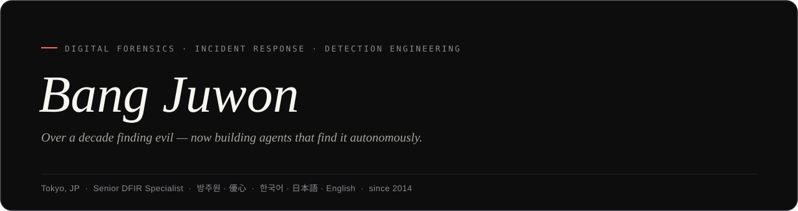

<!-- Profile banner — adapts to the viewer's light/dark theme -->

  <!-- Single dark banner: GitHub's <picture> theme-swap follows the browser's
       prefers-color-scheme, not the GitHub theme, so a light banner can land on
       a dark profile (and look stark). A dark banner reads well on both. -->
  

  
  &nbsp;
  
  &nbsp;
  
  &nbsp;
  

---

Building autonomous detection systems and architectural security guarantees.
Currently exploring **agentic DFIR** &mdash; MCP-based forensic agents that
encode the reasoning pattern of a senior analyst as *architecture, not as a prompt*.

> The interesting problem in "AI for security" isn't the model &mdash; it's the
> **architecture**: tool boundaries, deterministic correlation, evidence chains,
> audit trails. Guardrails belong in the surface, not the system prompt.

### &#9670;&nbsp; Focus

- **Digital Forensics &amp; Incident Response** &nbsp;&middot;&nbsp; Windows / macOS / Linux
- **Detection Engineering** &nbsp;&middot;&nbsp; MITRE ATT&amp;CK coverage modeling, Sigma
- **DevSecOps &amp; Security Automation**
- **Agentic AI for Security** &nbsp;&middot;&nbsp; MCP, audit-chained reasoning loops

### &#9670;&nbsp; Stack

  
  
  
  
  

  
  
  
  
  
  

### &#9670;&nbsp; Featured Projects

#### 🎯 Agentic-DART &nbsp;*flagship — SANS FIND EVIL! 2026*

> Autonomous DFIR agent. Architecture-first, not prompt-first. Read-only MCP
> surface (native pure-Python + SIFT adapters) makes destructive ops impossible
> by construction. v1.0.2 — 72 typed read-only MCP tools, full passing test suite,
> 11 case studies, and 99 ground-truth findings. External case-study slots
> include NIST CFReDS, Ali Hadi, and Digital Corpora M57. SANS FIND EVIL! 2026
> entry.

→ [github.com/Juwon1405/agentic-dart](https://github.com/Juwon1405/agentic-dart) &nbsp;·&nbsp; [Submission to SANS FIND EVIL! 2026](https://findevil.devpost.com/) &nbsp;·&nbsp; MIT

#### Other projects

<table>
<tr>
<td width="50%" valign="top">

#### 🔌 [agentic-dart-collector-adapter](https://github.com/Juwon1405/agentic-dart-collector-adapter) &nbsp;*new — Phase 1.3*

> **Velociraptor → evidence_root adapter** &mdash; stdlib-only Python
> layer that converts Velociraptor offline-collector ZIPs into the
> `evidence_root` layout Agentic-DART consumes. Seeds chain-of-custody
> (manifest.json 1.2 + SHA-256 index + source-member provenance) and prevents
> flat-layout basename collisions from overwriting evidence.

</td>
<td width="50%" valign="top">

#### 📓 [GitNote](https://github.com/Juwon1405/GitNote)

> **GitNote** &mdash; curated personal knowledge base in InfoSec &amp;
> computer science. A long-running collection of notes, references,
> and code snippets from years of DFIR / detection engineering work.

</td>
</tr>
</table>

📦 Archived projects

 

#### 🧪 [yushin-gendfir-rag](https://github.com/Juwon1405/yushin-gendfir-rag) &nbsp;*archived*

Unofficial Python replication of Loumachi, Ghanem &amp; Ferrag (2024). RAG + LLM pipeline for DFIR cyber-incident timeline analysis. The work in this repository served as a foundation that informed the design of [agentic-dart](https://github.com/Juwon1405/agentic-dart), which supersedes it with agentic (rather than pure RAG) reasoning and a hardened MCP surface. Kept public as a reference artifact.

#### 🍎 [yushin-mac-artifact-collector](https://github.com/Juwon1405/yushin-mac-artifact-collector) &nbsp;*archived*

Single-file bash DFIR artifact collector for macOS hosts where Velociraptor is not an option. Originator of the supply-chain IOC sweep patterns (litellm PyPI 2026-03, npm typosquat detection) now ported and generalized into [agentic-dart](https://github.com/Juwon1405/agentic-dart). Kept public as a supply-chain reference.

#### 🔬 [yushin-mac-forensics-platform](https://github.com/Juwon1405/yushin-mac-forensics-platform) &nbsp;*archived*

Flask-based macOS DFIR web platform that ingested collector ZIPs &amp; disk images (DD/RAW/E01/AFF/DMG) and produced searchable evidence + PDF incident reports. Paused for post-SANS repositioning as the [agentic-dart](https://github.com/Juwon1405/agentic-dart) web UI &mdash; reading `findings.json` + `audit.jsonl` from an Agentic-DART run and rendering them in the browser.

### &#9670;&nbsp; Published Work

- ***Network Attack Packet Analysis for Security Practitioners* &nbsp;·&nbsp; 보안 실무자를 위한 네트워크 공격 패킷 분석** &nbsp;(co-author, lead) 
  Freelec, 2019.11 &nbsp;·&nbsp; ISBN 9788965402589 &nbsp;·&nbsp; ~370 pp. 
  A practitioner's reference covering DDoS, web exploitation, malicious traffic, wireless intrusion, system exploitation, and large-volume packet analysis. 
  → [Yes24](https://www.yes24.com/Product/Goods/83538369) &nbsp;·&nbsp; [Aladin](https://www.aladin.co.kr/shop/wproduct.aspx?ItemId=217703927) &nbsp;·&nbsp; [Kyobo](https://product.kyobobook.co.kr/detail/S000001019678) &nbsp;·&nbsp; [Google Books](https://books.google.com/books?id=SIrIywEACAAJ)

### &#9670;&nbsp; Selected Recognition

- **🥇 Gold Prize**, 2017 Korea Open-Source Software Developer Contest &nbsp;(NIPA, *national OSS award*)
- **📜 Patent (filed)**: *Security Event Correlation Analysis Apparatus* &nbsp;(2018, Netmarble Corp.)
- **🎯 4th place**, 2017 CCE National Cyber Defense Competition &nbsp;(National Intelligence Service of Korea)
- **🐛 Special Prize**, 2015 LINE Bug Bounty Program &nbsp;(LINE Corp.)

### &#9670;&nbsp; Curated &amp; Community

- [**Awesome Stars** (GitNote)](https://github.com/Juwon1405/GitNote/blob/main/Resources/awesome-stars.md) ⭐ &mdash; starred repos sorted into curated buckets (DFIR / Blue Team / AI / Red Team / Malware / OSINT), regenerated after curation passes.
- Lists: [DFIR](https://github.com/stars/Juwon1405/lists/dfir) &middot; [BlueTeam](https://github.com/stars/Juwon1405/lists/blueteam) &middot; [Tools &amp; Tips](https://github.com/stars/Juwon1405/lists/tools-tips) &middot; [DevSecOps](https://github.com/stars/Juwon1405/lists/devsecops) &middot; [Gist](https://gist.github.com/Juwon1405)
- **YouTube** &mdash; [DoubleS1405](https://www.youtube.com/c/DoubleS1405), a long-running Korean-language information-security lecture channel (2014–present).

### &#9670;&nbsp; Open to

Research collaboration &middot; CTF &middot; CSIRT exchange &middot; Open-source security tooling

 

  
  &nbsp;
  

<em>Juwon Bang &middot; 방주원 &middot; 優心 (YuShin)</em>

